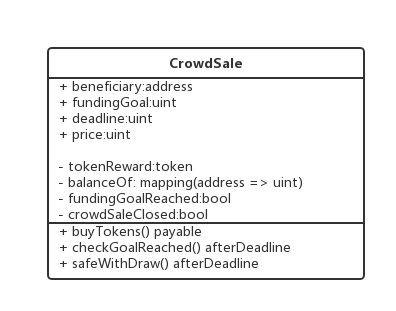
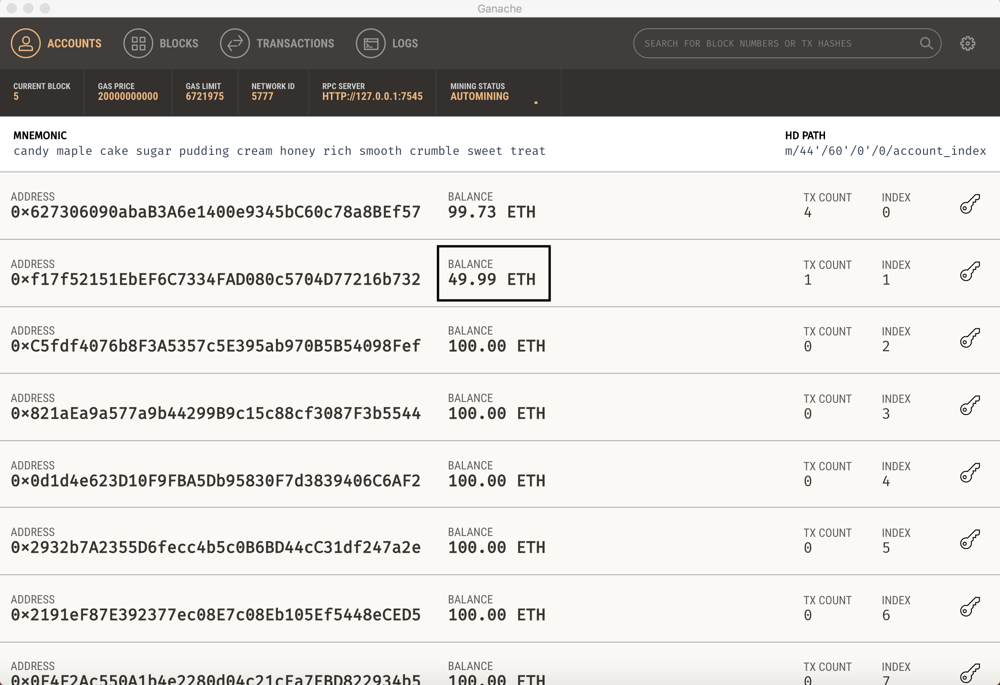
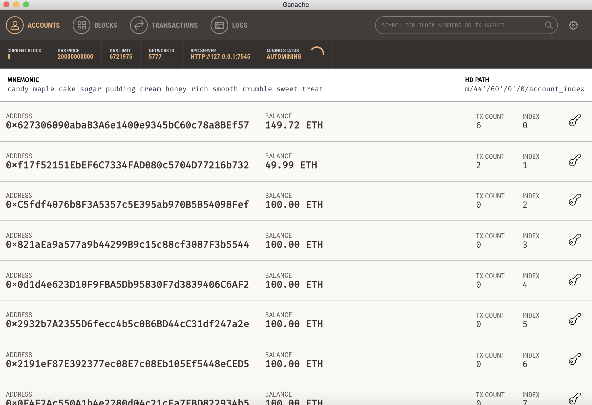
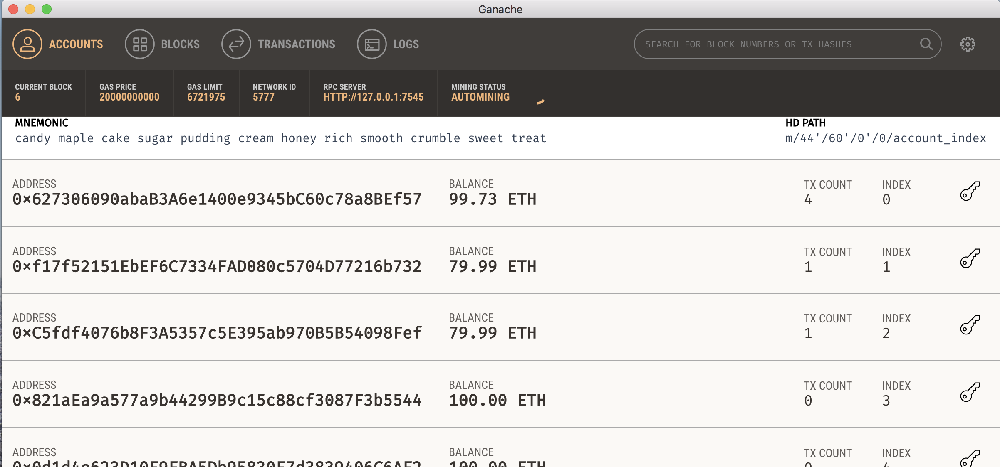
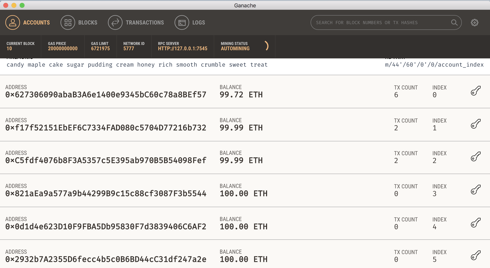

### 使用ERC20标准的Token进行众筹
#### 众筹合约内容
合约中有两种角色：
1. 发起众筹的受益人beneficiary
2. 参与众筹的贡献者contributor

这是一个简化的，理想的众筹合约。
合约中，众筹人发布100个Token，目标筹集50 eth，并设定众筹的时间，Token与eth汇率是1：10。
合约会执行：
1. 受益人发行总量为100.0的Token，所有Token发行时都在受益人的账户中。
2. 同时，受益人开启众筹，众筹合约有初始化参数：目标筹集eth数量、token与eth兑换比率、众筹时长、达到目标的时间。
3. 贡献者可以通过调用合约中的方法，花费eth购买对应数额的Token。
4. 众筹持续时间结束之后，如果众筹的数额达到了预期设定的目标，受益人便可以将众筹的eth从合约总全部取出。
如果众筹的数额没有达到预期设定的目标，那么所有参与众筹的贡献者可以取回自己的eth。

下面是CrowdSale的类图：



#### truffle+zeppelin-solidity库的简单实现

##### 部署合约
创建工作空间，truffle初始化，引入zeppelin-solidity库，与2.3步骤几乎相同。

下面是Contract的code。

MyToken.sol:

```
pragma solidity ^0.4.17;

import 'zeppelin-solidity/contracts/token/ERC20/StandardToken.sol';

contract MyToken is StandardToken {

    string public name = 'MyToken';
    string public symbol = 'MT';
    uint8 public decimals = 2;
    uint public INITIAL_SUPPLY = 100;

    function MyToken() public {
         totalSupply_ = INITIAL_SUPPLY;
         balances[msg.sender] = INITIAL_SUPPLY;
    }
}
```

Crowdsale.sol

```
pragma solidity ^0.4.16;

import "./MyToken.sol";

contract Crowdsale {
    address public beneficiary;
    uint public fundingGoal;
    uint public amountRaised;
    uint public deadline;
    uint public price;
    MyToken public tokenReward;
    mapping(address => uint256) public balanceOf;
    bool fundingGoalReached = false;
    bool crowdsaleClosed = false;

    event GoalReached(address recipient, uint totalAmountRaised);
    event FundTransfer(address backer, uint amount, bool isContribution);

    /**
     * Constrctor function
     *
     * Setup the owner
     */
    function Crowdsale(
        address ifSuccessfulSendTo,
        uint fundingGoalInEthers,
        uint durationInMinutes,
        uint etherCostOfEachToken
    ) {
        beneficiary = ifSuccessfulSendTo;
        fundingGoal = fundingGoalInEthers * 1 ether;
        deadline = now + durationInMinutes * 1 minutes;
        price = etherCostOfEachToken * 1 ether;
        // tokenReward = token(addressOfTokenUsedAsReward);
        tokenReward = new MyToken();
    }

    /**
     * 购买token, 调用者调用合约附带的所有eth将用来购买token
     */
    function buyTokens() payable {
        require(!crowdsaleClosed);
        uint amount = msg.value;
        balanceOf[msg.sender] += amount;
        amountRaised += amount;
        tokenReward.transfer(msg.sender, amount / price);
        FundTransfer(msg.sender, amount, true);
    }

    /**
     * 查询token的余额。
     */
    function tokenOwned(address who) public view returns (uint256) {
        return tokenReward.balanceOf(who);
    }


    modifier afterDeadline() { if (now >= deadline) _; }

    /**
     * Check if goal was reached
     *
     * Checks if the goal or time limit has been reached and ends the campaign
     */
    function checkGoalReached() afterDeadline {
        if (amountRaised >= fundingGoal){
            fundingGoalReached = true;
            GoalReached(beneficiary, amountRaised);
        }
        crowdsaleClosed = true;
    }


    /**
     * Withdraw the funds
     *
     * Checks to see if goal or time limit has been reached, and if so, and the funding goal was reached,
     * sends the entire amount to the beneficiary. If goal was not reached, each contributor can withdraw
     * the amount they contributed.
     */
    function safeWithdrawal() afterDeadline {
        if (!fundingGoalReached) {
            uint amount = balanceOf[msg.sender];
            balanceOf[msg.sender] = 0;
            if (amount > 0) {
                if (msg.sender.send(amount)) {
                    FundTransfer(msg.sender, amount, false);
                } else {
                    balanceOf[msg.sender] = amount;
                }
            }
        }

        if (fundingGoalReached && beneficiary == msg.sender) {
            if (beneficiary.send(amountRaised)) {
                FundTransfer(beneficiary, amountRaised, false);
            } else {
                //If we fail to send the funds to beneficiary, unlock funders balance
                fundingGoalReached = false;
            }
        }
    }
}

```

truffle部署的js如下，注意Crowdsale的构造函数是带参的，所以在部署时要把参数传递过去，这里第一个地址是ganache自带的10个账户中的第一个的address。
```
var Crowdsale = artifacts.require("Crowdsale");

module.exports = function(deployer) {
    deployer.deploy(Crowdsale, "0x627306090abaB3A6e1400e9345bC60c78a8BEf57", 1000, 20, 10);
};
```

部署过程与2.3介绍的相同，编译后，开启ganache，在```truffle.js```中配置好连接到ganache节点后，然后将合约部署上去。

编译过程中或报出很多警告，提示方法没有明确可见性，因为默认是public的，警告忽略掉就行。

##### 运行合约
这次我使用truffle的console与合约进行交互。
```
truffle console
```
进入控制台后，为了简化合约的调用，还要手动封装一下命令。
```
var app = Crowdsale.deployed().then(function(instance){app = instance;})
```
封装Crowdsale合约。然后调用合约的方法参与众筹。使用ganache创建好的10个用户之中的第二个用户，进行token购买。
```
app.buyTokens({from:web3.eth.accounts[1], value:50*1000000000000000000})
```
其中buyTokens方法本身是无参的，但是可以改变这一次调用的信息```msg```的一些参数，这里修改了方法调用人为```accounts[1]```,
发送给合约的eth为50，由于这里value是使用```wei```，eth中最小的计量单位，```1 eth = 10 ** 18 wei```，所以要乘上10^18。
调用成功后湖出现下面的tx信息：

```
truffle(development)> app.buyTokens({from:web3.eth.accounts[1],value:50*1000000000000000000})
   { tx: '0xa88762eb901fb75aecddd529c0dd0b61e275bda3fe757784ff90c09dc8c81b32',
     receipt: 
      { transactionHash: '0xa88762eb901fb75aecddd529c0dd0b61e275bda3fe757784ff90c09dc8c81b32',
        transactionIndex: 0,
        blockHash: '0xe4c5594983760209ed5336a2c03d45c966500704b1b9cd991e45a00d5b877be2',
        blockNumber: 5,
        gasUsed: 94866,
        cumulativeGasUsed: 94866,
        contractAddress: null,
        logs: [ [Object], [Object] ],
        status: '0x01',
        logsBloom: '0x00400000000000000000000000000000000000000000004000000000000080000000000000000020000000000000000000000000000000000000000000000000400000000000000000000008000000000000000000010000000080000000000000000000000000000000000000000000000000000000000000000010000000000400000000010000000000000000000000000000000000000000000080000000000000000000000000000000000000000000000000000000000000000000000000000002000000000080000000001000000000000000004000000000000000001000000000000000000000000000000000000000000000000010000000000000' },
     logs: 
      [ { logIndex: 1,
          transactionIndex: 0,
          transactionHash: '0xa88762eb901fb75aecddd529c0dd0b61e275bda3fe757784ff90c09dc8c81b32',
          blockHash: '0xe4c5594983760209ed5336a2c03d45c966500704b1b9cd991e45a00d5b877be2',
          blockNumber: 5,
          address: '0x345ca3e014aaf5dca488057592ee47305d9b3e10',
          type: 'mined',
          event: 'FundTransfer',
          args: [Object] } ] }
```

然后可以看到ganache中ac2的eth减少了50：


查询token，返回的BigNumber的，看不太懂，转换成number
```
truffle(development)> app.tokenOwned(web3.eth.accounts[1])
BigNumber { s: 1, e: 0, c: [ 5 ] }
truffle(development)> app.tokenOwned(web3.eth.accounts[1]).then(function(balance){console.log(balance.toNumber())})
5
```
50个eth购买了5个token。再查询下众筹的eth总量。同样需要转化单位。
```
truffle(development)> app.amountRaised.call().then(function(amount){console.log(web3.fromWei(amount.toNumber(), 'ether'))})
50
```
可以看到，在众筹进行中，购买token的动作可以正确执行。

###### 合约结束情况1：成功募集到目标金额
```
truffle(development)> app.checkGoalReached()
truffle(development)> app.safeWithdrawal({from:web3.eth.accounts[0]})
```
结果如下：



###### 合约结束情况2：未能成功募集到目标金额

关闭ganache，重新启动，ganache私有链状态会重置，再将合约重新部署到链上。
这次使index为1，2的两个用户参与众筹，每人购买20eth的token，等到众筹时间结束时，
将不能达到众筹的目标。ac1和ac2可以正常的取回自己的eth。




```
truffle(development)> app.checkGoalReached()
truffle(development)> app.safeWithdrawal({from:web3.eth.accounts[0]})
truffle(development)> app.safeWithdrawal({from:web3.eth.accounts[1]})
truffle(development)> app.safeWithdrawal({from:web3.eth.accounts[2]})
```

结果如下：



看到ac1和ac2的eth已经退回到了原来的账户中。合约可以按照描述正确执行。


