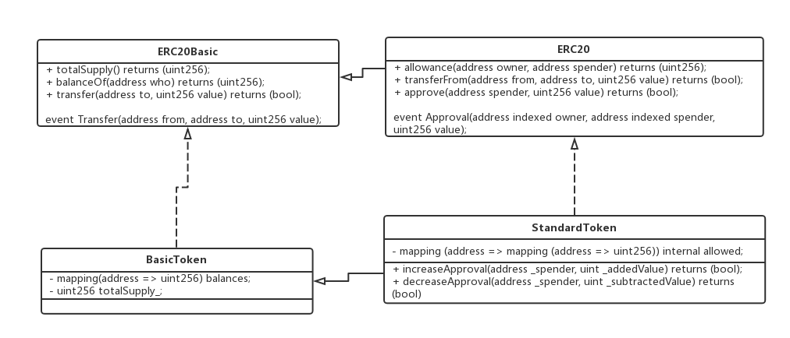
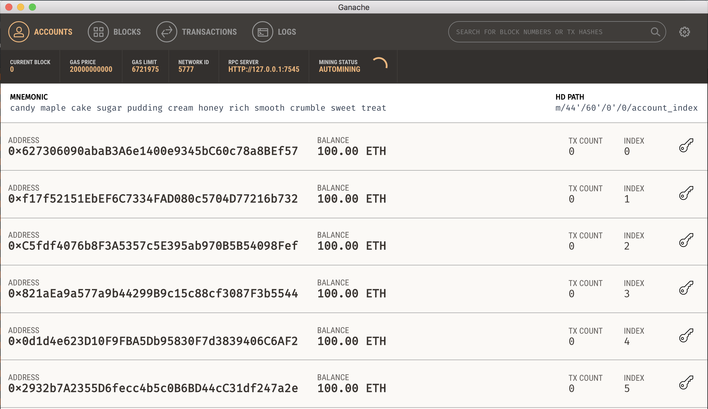
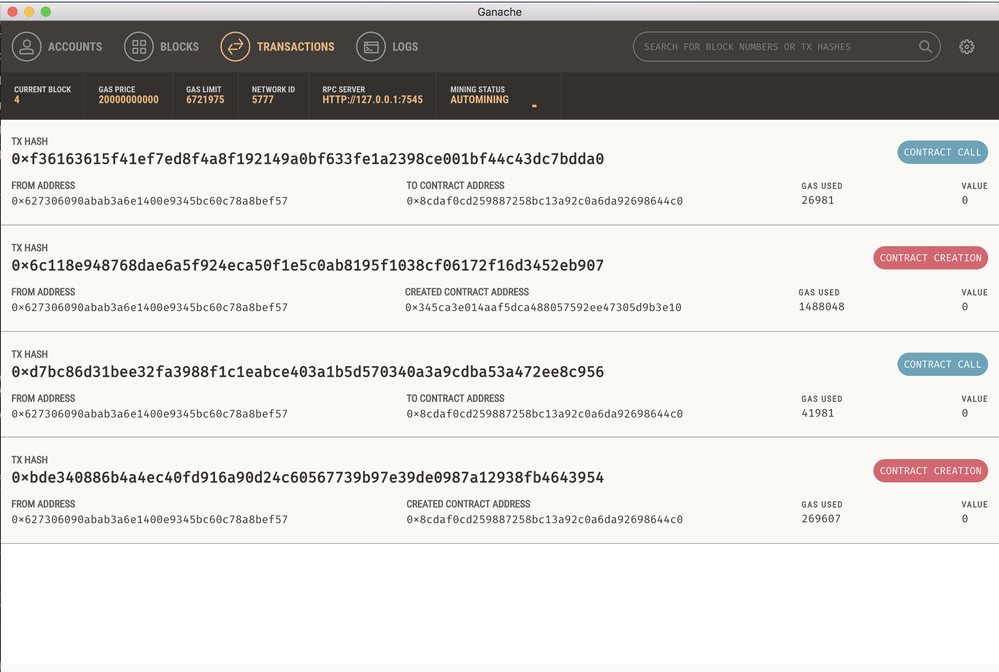

## 借助OpenZeppelin的solidity库发布简单的代币
### OpenZeppelin介绍
OpenZeppelin是一个在以太坊上编写安全智能合约的库。我们使用并且扩展他们的库，在较短时间内构建自己的更加安全的dapps。
OpenZeppelin实现了ERC20代币标准，目前我就是通过继承```StandardToken.sol```发布自己的代币。

 ```StandardToken.sol``` 的类图如下：



github:[https://github.com/OpenZeppelin/zeppelin-solidity]


### 概要
* 从truffle中载入前端应用页面
* 创建智能合约"MyToken"
* 编译部署智能合约到开发网络中
* 与发布的代币交互

#### 载入前端应用页面
1.创建工作空间
```
mkdir mytoken-workspace
cd mytoken-workspace
```
2.载入前端
```
truffle unbox tutorialtoken
```
载入之后，truffle相关的包结构也创建好了：
* ```contracts/``` : solidity合约目录
* ```migrations/``` : 可编写脚本的部署文件的目录
* ```test/``` :  用于测试您的应用程序和合同的测试文件目录
* ```truffle.js``` :  Truffle配置文件

3.安装OpenZeppelin的solidity库
```
npm install zeppelin-solidity
```

#### 创建智能合约"MyToken"
1. 在```contracts```目录下，创建```MyToken.sol```的合约文件，添加以下的内容。
```
pragma solidity ^0.4.17;
import 'zeppelin-solidity/contracts/token/ERC20/StandardToken.sol';
contract MyToken is StandardToken {
}
```
2. 使用```is```从```StandardToken```中继承了变量和方法。我们可以自己设置Token的一些参数：
```
string public name = 'MyToken';
string public symbol = 'MT';
uint8 public decimals = 2;
uint public INITIAL_SUPPLY = 10000;
```
solidity语言中，标记为public的变量，会自动创建一个getter方法，方法名与变量名相同。
3. 最后创建构造方法，将```totalSupply_``` 赋值为```INITIAL_SUPPLY```，并且将初始发行的所有货币分配给发行者。
```
function MyToken() public {
     totalSupply_ = INITIAL_SUPPLY;
     balances[msg.sender] = INITIAL_SUPPLY;
}
```

#### 编译部署智能合约到开发网络中
1. 在```migrations/```目录下，创建名为```2_deploy_contracts.js```的文件，添加以下的内容。
```
var MyToken = artifacts.require("MyToken");
module.exports = function(deployer) {
  deployer.deploy(MyToken);
};
```
2. 启动ganache，安装和介绍见2.1。

ganache默认启动端口是7545，项目中的truffle.js中配置也是7545，不需要改动。
3. 将合约部署到链上。
```
truffle migrate
```
使用```migrate```命令是将合约部署到指定的节点，这里指定的是本地的ganache开发节点。执行将出现：
```
migration: 1_initial_migration.js
  Deploying Migrations...
  ... 0xbde340886b4a4ec40fd916a90d24c60567739b97e39de0987a12938fb4643954
  Migrations: 0x8cdaf0cd259887258bc13a92c0a6da92698644c0
Saving successful migration to network...
  ... 0xd7bc86d31bee32fa3988f1c1eabce403a1b5d570340a3a9cdba53a472ee8c956
Saving artifacts...
Running migration: 2_deploy_contracts.js
  Deploying MyToken...
  ... 0x6c118e948768dae6a5f924eca50f1e5c0ab8195f1038cf06172f16d3452eb907
  MyToken: 0x345ca3e014aaf5dca488057592ee47305d9b3e10
Saving successful migration to network...
  ... 0xf36163615f41ef7ed8f4a8f192149a0bf633fe1a2398ce001bf44c43dc7bdda0
Saving artifacts...
```
表明合约已经成功部署到节点上了。ganache同样会列出这些交易。


#### 与发布的代币交互

如果没有在第一步中载入truffle提供的前端的页面，直接使用truffle的console也可以调用合约。

Truffle封装了js调用合约的代码，[官方文档](http://truffleframework.com/docs/getting_started/contracts)也提供较为详细的介绍。

这里前端页面，为了更加方便快捷地切换账户，使用[MetaMask](https://metamask.io/)，这是个浏览器的插件（支持chrome和firefox），
下载完之后，参考[tutorial配置](http://truffleframework.com/tutorials/pet-shop#interacting-with-the-dapp-in-a-browser)，


```TODO…… // 后续步骤可以在Truffle Tutorials 中的 BUILDING ROBUST SMART CONTRACTS WITH OPENZEPPELIN看到```


相关链接：

* [Truffle Tutorials](http://truffleframework.com/tutorials/)
* [Solidity docs](http://solidity.readthedocs.io/en/develop/index.html)
